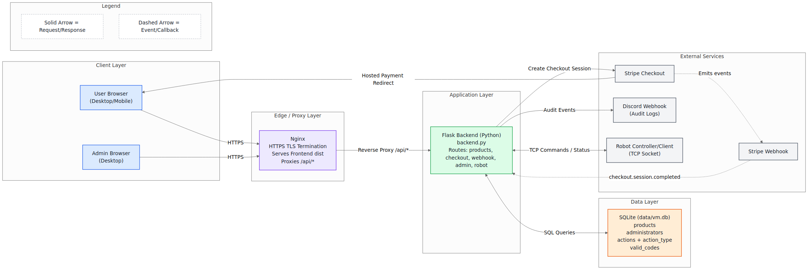

# [Vending Machine Website](https://github.com/orgs/Vendning-Machine-Team/repositories) - Website Team (Backend)
### By Samantha Machado, Prince Patel, Matthew Beck, and Syan Shirazi

__Please Consider__: If you like it __star it__!

## Tech Stack
- **Language**: Python
- **Backend Framework**: Flask + CORS support
- **Database**: SQLite with SQL schema in data/schema.sql
- **Payments**: Stripe Checkout + Stripe Webhooks
- **Security / Auth Utilities**: bcrypt *(for password hash verification)*
- **Integrations / Utilities**: requests *(Discord webhooks)*, python-dotenv *(environment configuration)*, TCP sockets + threading *(robot bridge)*

## Roles

  

**Samantha Machado ([LinkedIn](https://www.linkedin.com/in/samantha-machado-b7b5a7329/) | [GitHub](https://github.com/SamMac55)):**
- Software Architect *(architected backend structure)*
- Database Administrator *(created Database Schema and populated tables with data)*
- DevOps Engineer *(set up EC2 instance, collaborated to separate frontend-backend repos, migrated DNS to AWS)*

  

**Prince Patel ([LinkedIn](https://www.linkedin.com/in/ppatel9114/) | [GitHub](https://github.com/IMPr1nce)):**
- Software Engineer *(integrated Stripe payment system)*

  

**Matthew Beck ([LinkedIn](https://www.linkedin.com/in/matthewthomasbeck/) | [GitHub](https://github.com/matthewthomasbeck) | [Website](https://www.matthewthomasbeck.com)):**
- Software Engineer *(created web socket to deliver messages from the frontend to the robot)*
- DevOps Engineer *(assisted with EC2 instance setup, collaborated to migrate website frontend and backend to separate repos)*

  

**Syan Shirazi ([LinkedIn](www.linkedin.com/in/syan-shirazi) | [GitHub](https://github.com/SturdyDude))**
- Penetration Tester *(frontend and backend related testing to ensure that users cannot access the backend or critical information from the frontend)*

## Overview
The backend is a Flask application centered in backend.py that serves both API functionality and built [frontend](https://github.com/Vendning-Machine-Team/Vending_Machine_Website-Frontend) assets from ./dist, exposing REST endpoints under /api/* for customer checkout flows, administrator operations, product listing, checkout session creation, and post-payment code retrieval. It supports SPA-style fallback routing for frontend refreshes and is configured via environment variables (.env) for Stripe keys, webhook secrets, base URL redirects, robot host/port, and runtime settings.

Operationally, the API is organized around three domains: product/inventory management, admin activity, and checkout fulfillment, backed by a SQLite database (data/vm.db) with schema defined in data/schema.sql (products, administrators, actions, action_type, valid_codes). Admin authentication uses bcrypt for password verification, inventory updates are logged to the actions table, heartbeat endpoints track admin activity, and recent action history is exposed for monitoring.

For payments and delivery, the backend integrates with Stripe to create Checkout sessions from cart payloads, embedding metadata for downstream processing and handling signed webhook callbacks for payment confirmation. Fulfillment is idempotent (fulfill_checkout_session), ensuring atomic inventory decrementation and generation of a unique 4-digit vending code per session, retrievable via /api/get-code.

Additional system features include a persistent TCP [robot](https://github.com/Vendning-Machine-Team/Vending_Machine_Robot-Hardware) bridge for command relay and connection status reporting (/api/robot-command, /api/robot-status), and Discord-based audit logging for frontend reports, inventory changes, and fulfillment-related events.

